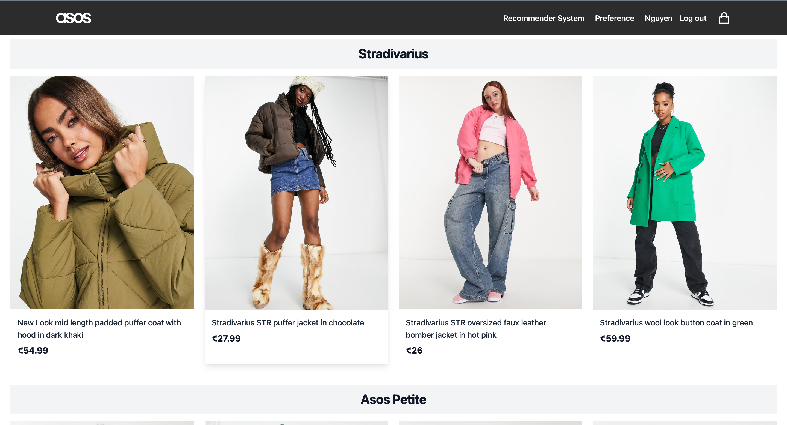
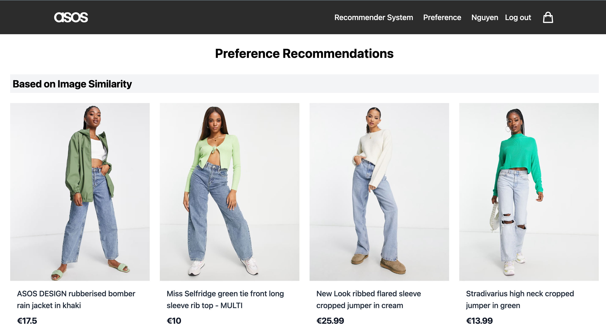

# Image-Text-Recommender-System

A modern clothing e-commerce platform built with **ReactJS**, featuring an advanced **Image-Text Recommender System**. This project integrates semantic search and personalized recommendations to enhance the user shopping experience.

## 🚀 Overview

This repository hosts the source code for a fashion e-commerce application that goes beyond simple keyword matching. By leveraging a vector database, the application understands the *context* of user searches (semantic search) and provides personalized product suggestions based on visual and textual data.

## ✨ Key Features

### Frontend
* **Responsive UI:** A clean, modern interface built with **ReactJS**.
* **Dynamic Product Display:** Rich product visualization with image and text details.
* **User History Tracking:** Captures user search behavior to feed the recommendation engine.

### Backend & AI
* **Semantic Search Engine:** Allows users to search for products using natural language, powered by vector embeddings (Text & Image).
* **Personalized Recommendations:** Suggests products based on the user's previous search history.
* **Standard Filtering:** robust filtering by Brand and SKU.

## 🛠 Tech Stack

* **Frontend:** ReactJS
* **Backend API:** Nodejs:Json-server ||  Python: FastAPI, Transformers, Qdrant
* **Databases:**
    * **User Data:** `json-server` (Mock DB for user profiles/sessions)
    * **Product Data:** `asos_products.csv` after filtering/cleaning the raw data from HuggingFace [Link](https://huggingface.co/datasets/UniqueData/asos-e-commerce-dataset/viewer/default/train?row=1&views%5B%5D=train)
    * **Vector Database:** Qdrant vector database, the vectors are embedded from products' text & images using `clip-ViT-B-32`

## 🔌 API Documentation

The backend is built with **FastAPI** and exposes endpoints for product retrieval, semantic search (using CLIP), and recommendations.

**Base URL:** `http://localhost:8000`

### 1. Product Retrieval

| Method | Endpoint | Description | Query/Body |
| :--- | :--- | :--- | :--- |
| `GET` | `/` | Retrieve a specific product details by its SKU. | **Query Param:** `?sku=12345` |


| `POST` | `/products-by-brand` | Get top 4 products filtered by a specific brand. | **JSON Body:** `{"brand": "Nike"}` |



### 2. Semantic Search (`/search`)

This endpoint allows searching via **Text** or **Image** using the CLIP model. It accepts `multipart/form-data`.

* **Method:** `POST`
* **Endpoint:** `/search`
* **Content-Type:** `multipart/form-data`

**Form Parameters:**

| Parameter | Type | Required? | Description |
| :--- | :--- | :--- | :--- |
| `file` | File (Image) | Optional | Upload an image to find visually similar products (Image-to-Image search). |
| `query_text` | String | Optional | Enter a text description to find matching products (Text-to-Text search). |
| `brand` | String | Optional | Filter results by brand name. |
| `color` | String | Optional | Filter results by color. |

> **Note:** You must provide either `file` or `query_text`.


### 3. Recommendation System for the last purchase (`/preference`)

Generates a dual-list of recommendations (Visual & Textual) based on a specific product SKU.

* **Method:** `POST`
* **Endpoint:** `/preference`
* **Query Parameter:** `sku` (The ID of the product the user is currently viewing).

**Response Structure:**
The API returns a JSON object containing two lists:
```json
{
  "image": [ ...list of visually similar products... ],
  "text": [ ...list of descriptively similar products... ]
}
```
> **Note:** The Page only work for User who has purchases in the history.



## 📂 Database Structure

The project utilizes a hybrid database approach to handle different data types efficiently:

1.  **User Database (`json-server`)**:
    * Lightweight storage for user profiles and session data during development.
2.  **Product Database**:
    * Stores core product metadata (sku, name, brand, color, price, ...) in `asos_products.csv`
3.  **Vector Database**:
    * Stores high-dimensional embeddings of product **images** and **descriptions + name** in local `qdrant_storage`.


## 📦 Installation & Setup

Follow these steps to get the project running locally.

### Prerequisites
* Docker
* Node.js & npm
* Python >= 3.11
* Clone the repository
  ```bash
    git clone https://github.com/TrueNguyen203/Image-Text-Recommendation-System.git
    cd Image-Text-Recommendation-System
    ```
### RecommendAI folder:

1.  Intitiate Qdrant server using docker:
    ```bash
    docker pull qdrant/qdrant
    mkdir -p qdrant_storage

    docker run -p 6333:6333 -p 6334:6334 \
      -v "$(pwd)/qdrant_storage:/qdrant/storage" \
      qdrant/qdrant
    ```

2.  **Create virtual venv and install RecommendAI Dependencies**
    ```bash
    python -m venv venv
    source venv/activate/bin
    pip intall -r requirements.txt
    ```

3.  **Embedding the images and text** (Only the first time, the next time just need to start the docker image)
    ```bash
    python run_ingest.py
    ```

4.  **Run the API**
    ```bash
    python -m api.main
    ```

### userdb folder:

1.  Install dependencies:
    ```bash
    npm intall
    ```

2.  **Starting the API**
    ```bash
    node ./server.js
    ```

## frontend folder
1.  Install dependencies:
    ```bash
    npm intall
    ```
2. **Starting the frontend app**
    ```bash
    npm run dev
    ```

## 🤝 Contributors:
- Chu Cao Nguyên
- Nguyễn Đức Anh
- Nguyễn Mạnh Dũng
- Nguyễn Khánh Toàn
- Nguyễn Tiến Tuấn Thành

## 📄 License

This project is licensed under the MIT License.


